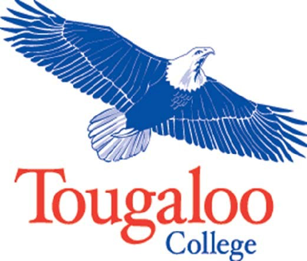

Dr. Beverly W. Hogan

President and CEO

Submitted by

Denese Carroll, CIO draft as of 6/15/16 4:43 PM

Introduction
=============

The purpose of the *Information Technology (IT) Policies and Procedures Manual* is to provide a guide for employees and students in the planning, acquisition, use, and management of information technology and
telecommunications resources at Tougaloo College (TC). It assigns responsibility and defines the authority for implementing computer and network standards, operational standards, and training, and is intended
as a handbook for users as well as an operations management tool.

The information technology resources at Tougaloo College, including computers, printers, local area networks/wide area networks (LAN/WAN networks), software, electronic mail (e-mail), Web sites, video,
telephones, and voice mail, are the property of the College, unless designated otherwise at the time of acquisition, and are provided for use by authorized students, faculty, and staff. Individuals who utilize
these assets accept responsibility for their proper use.

College Mission
===============

Tougaloo College is a private, historically black, liberal arts institution, accessible to all persons regardless of race, ethnic origin, religion or creed. The College prepares students to be imaginative, self-directed, lifelong learners and mindful thinkers, committed to leadership and services in a global society by offering a
high quality liberal studies program.

Founded in 1869 by the American Missionary Association, Tougaloo College was chartered on the principles that it "be accessible to all irrespective of their religious tenets, and conducted on the most
liberal principles for the benefit of our citizens in general."

Tougaloo acknowledges and respects its traditions, remains dedicated to the equality of all people, and continues to be a value-oriented community where students are guided by a concerned faculty and staff.

The members of this community apply current knowledge to prepare students for lifelong learning related to new information and emerging technologies, as well as humane standards in a global society.

Tougaloo offers an undergraduate curriculum designed to encourage students to apply critical thought to all areas of life, to acquire a basic knowledge of the humanities, the natural sciences, and the social
sciences, to develop skills required in selected professions; and to provide leadership in a democratic society and in a changing world.

Tougaloo intends that its students become self-directed learners and self-reliant persons capable of dealing with people, challenges and issues. Tougaloo College intends to contribute to the social, health,
and educational needs of the local and state communities through a program of community service.

Office of Information Technology (OIT) Mission
==========================================================================================================================================

The Office of Information Technology exists to bring information technology into the classroom; to develop faculty, students and staff who are familiar with the use of information technology; to integrate
information technology into the planning, administrative, operational and academic activities of the College; to link and integrate the information technology infrastructure to the campus; and to provide
responsive technical support to students, faculty, staff and community users.

Goals
=====

The major goal of the Office of Information Technology and its component parts is to infuse College programs and operations with appropriate and cost-effective technologies that will measurably improve information
access and management, student learning, scholarship, research, and administrative processes. OIT will collaborate with departments and divisions to insure that the skills, tools, and information needed to
succeed using the technology provided and are available.

Instructional Technology
---------------------------------------------------------------------------------------------------------------------------------

Instructional technology is the infrastructure and processes needed for the effective application of technology to instruction. OIT supports instructional technology by focusing on providing the
resources, training and support to ensure that Tougaloo College educators reach a consistent technology standard that enhances the teaching and learning process with each classroom through the
effective use of technology.

Community Outreach and Service
---------------------------------------------------------------------------------------------------------------------------------

OIT will support the College’s goal for community service by designing and deploying an information technology infrastructure that is accessible to residents from the surrounding areas who are participants in College-sponsored activities and programs. An accessible infrastructure can help to build communities of interest and expertise, enhance collaboration and professional relationships, and leverage College expertise and resources to help solve community problems.

Administrative Systems and Operations
----------------------------------------------------------------------------------------------------------------------------------------------

OIT support for administrative systems and operations involves delivering reliable, secure, efficient, and commercial technology to simplify and streamline administrative processes. OIT, in consultation with users, proposes strategic investments that position information technology to serve the College mission.

Guiding Principles
=====================================================================================================================

Information technology policies and procedures are guided by a set of principles that affect short-term and strategic decision-making. These include the following:

  * IT policies and procedures will support the College’s mission and vision.
  * Policies emanate from the highest level of authority of the College
and therefore apply to all.
  * The Chief Information Officer (CIO) is the responsible authority for
all College information technology systems, including computer
hardware, software, networks, telecommunications, and related
peripherals. The CIO receives policy mandates from the President and
Cabinet.
  * All users will be treated equitably in the allocation of resources
and in the provision of technical support.
  * All information technology activities will be conducted in
accordance with industry standards and applicable state and federal
laws including copyright laws.

Organizational Structure
========================

The organizational structure of the Office of Information Technology
(OIT) consists of a Chief Information Officer (CIO), an Administrative
Assistant, and three (3) functional departments: Administrative
Information Technology, Networks, and Academic Information Technology.

Administrative Information Technology
------------------------------------------------------------------------------------------------------------------------------

The Administrative Information Technology department supplies
information systems, service and support for College administration
and staff to manage business processes and to facilitate effective
decision-making. It responds to the needs and questions of users
concerning access to network resources and the operation of various
software programs. The major administrative service areas include:

• Database administration

• Applications development

• Human resources and financial information systems

• Student Affairs

• Staff training

• Institutional Research

• Property Management

• Health & Wellness

Networks
-------------------------------------------------------------------------------------------------

The Networks department is responsible for designing, installing, and
maintaining local area network, wide area network and
telecommunications hardware, software and services. This includes
personal computers, communications system software, software
applications, servers, routers, bridges, switches, modems, cabling,
and telephone systems. The key network service areas include:

• Network engineering

• LAN/WAN networks

• Data/voice/video/wireless networks

• Desktop/laptop computers

• Help Desk

Academic Information Technology
---------------------------------------------------------------------------------------------------------------------------

The Academic Information Technology department provides planning,
coordination, implementation and evaluation of academic technologies
intended to enhance teaching and learning. It leads initiatives in
faculty and student technology skill development and Web-based
instruction as well as provides a liaison between information
technology and academic departments. The main service areas include:

• Academic systems

• Student information systems

• Library information systems

• Instructional technology

• Website development

• Enrollment management

• Computer labs

• Faculty training

• Media Services

Access to Information Technology Services
=========================================

Access to Resources
-------------------

Computers, networks and electronic information systems are essential
resources for accomplishing the Tougaloo College mission. The College
grants users shared access to these assets to support the
accomplishment of its mission. Such access is a privilege, not a
right, and users should be aware of the responsibilities associated
with this privilege.

-   Business use

As a member of the College community, you are provided with the use of
scholarly and/or work-related tools, including (but not confined to)
access to the Library and its systems, to certain computer systems,
servers, software, printers, services, databases, and electronic
publications; to the campus telephone and unified messaging systems;
and to the Internet. As a general matter, your use of all such
information technology should be for purposes that are consistent with
the business and mission of the College.

Computing and network equipment and mobile devices purchased by the
College remain the property of the College even if they are dedicated
for your use. Equipment purchased under research or other grants
normally is vested with the College though it is to be used for the
purposes of the grant. When College-owned equipment no longer is
needed, its disposition must be in compliance with College policy and
may not be determined independently by the user of the equipment.

Tampering with College-owned IT equipment, including cell or smart
phones, is defined as making unauthorized changes to the hardware or
system-level software that may be in conflict with license or may void
applicable warranties. College employees must not perform or condone
such actions. Exceptions sometimes may be made for purposes of
academic research.

-   Personal use

Personal use of the College's IT and digital resources should be
incidental and kept to a minimum. For example, use of such resources
by an employee for other than work-related matters should be
reasonable and limited so that it does not prevent the employee from
attending to and completing work effectively and efficiently, does not
incur additional cost to the College, and does not preclude others
with work-related needs from using the resources, including the shared
campus and Internet bandwidth. Individual departments or units may
place additional restrictions on personal use of the resources by
their employees.

All users must understand
and abide by the responsibilities that come with the privilege of use.
Such responsibilities include, but are not limited to, the following:

-   You must understand and comply with all applicable federal, state,
    and local laws. You must not use campus computing or networking
    resources or personal computing resources accessed through campus
    network facilities to collect, store or distribute information or
    materials, or to participate in activities that are in violation of
    federal, state or local laws.

-   You must not intentionally seek information about, browse, copy, or
    modify non-public files belonging to other people, whether at a
    Tougaloo College or elsewhere.

-   Willful or unauthorized misuse or disclosure of information owned by
    the College will also constitute just cause for disciplinary action,
    including dismissal from college and/or termination of employment
    regardless of whether criminal or civil penalties are imposed. It is
    also expected that any user will report suspected abuses of Tougaloo
    College resources. Failure to do so may subject the individual to
    loss of Tougaloo College access and/or disciplinary action.

-   You are authorized to use only computer resources and information to
    which you have legitimately been granted access. Sharing your
    passwords with others is expressly forbidden.

-   Any attempt to gain unauthorized access to any computer system,
    resource or information is expressly forbidden. If you encounter or
    observe a gap in system or network security, immediately report the
    gap to the manager of that system.

-   The College's Policy on Harassment applies as equally to electronic
    displays and communications as to the more traditional (e.g., oral
    and written) means of display and communication. You must not use
    campus computing or networking resources or personal computing
    resources accessed through campus network facilities to collect,
    store or distribute information or materials in violation of other
    Colleges policies or guidelines. These include, but are not limited
    to, policies and guidelines regarding all forms of harassment.

-   You must conform to laws and Colleges policies regarding protection
    of intellectual property, including laws and policies regarding
    copyright, patents, and trademarks. When the content and
    distribution of an electronic communication would exceed fair use as
    defined by the federal Copyright Act of 1976, users of campus
    computing or networking resources shall secure appropriate
    permission to distribute protected material in any form, including
    text, photographic images, audio, video, graphic illustrations, and
    computer software.

-   Messages, sentiments, and declarations sent as electronic mail or
    postings must meet the same standards for distribution or display as
    physical (paper) documents would on college property.

-   Unsolicited mailings and unauthorized mass mailings from campus
    networks or computing resources (i.e., “spam”) are prohibited.

-   You must not attempt to “sniff” or eavesdrop on data on the network
    that are not intended for you. Spoofing, or attempts to spoof or
    falsify e-mail, network or other information used to identify the
    source, destination or other information about a communication, data
    or information is prohibited.

-   You must not create or willfully disseminate computer viruses,
    worms, or other software intended to degrade system or
    network security.

-   Use of Tougaloo College resources for advertising, selling, and
    soliciting for commercial purposes or for personal gain is
    prohibited without the prior written consent of the College.
    Faculty, staff or students who have questions about the legitimacy
    of a particular use should discuss it with the Chief Information
    Officer or an authorized OIT manager.

-   The disclosure of individually identifiable non-directory
    information to non-College personnel is protected by the Family
    Educational Rights and Privacy Act of 1974 (FERPA).

-   You must not degrade computing or network performance in any way
    that could prevent others from meeting their educational or College
    business goals. You must not prevent others from using shared
    resources by running unattended processes or by playing games.

-   The Office of Information Technology at Tougaloo College may
    immediately suspend service to an individual or computer found to be
    significantly degrading the usability of the network or other
    computer systems. Inappropriate use will be referred to the
    appropriate College authority to take action, which may result in
    dismissal from the college and/or termination of employment.

**Note**: *The provisions of this Policy apply to the institutions
comprising Tougaloo College, including the remote locations such as
the Delta Health Partners locations, AHEC and Medgar Evers Home and
Museum.*

Access to Files and Your Right to Privacy
-----------------------------------------

-   The College's right to access files

All contents in storage on College data and voice systems are subject
to the rules of Tougaloo College, including the College's ability
under certain circumstances to access, restrict, monitor and regulate
the systems that support and contain them. In general, and subject to
applicable law, the College reserves the right to access and copy
files and documents (including e-mail and voice mail) residing on
College-owned equipment and in storage that may be contracted by the
College from outside enterprises. This includes access without notice,
where warranted. Non-intrusive monitoring of campus network traffic
occurs routinely, to assure acceptable performance and to identify and
resolve problems. If problem traffic patterns suggest that system or
network security, integrity, or performance has been compromised,
network systems staff will investigate and protective restrictions may
be applied until the condition has been rectified. It is also
important to note that the College may be required to produce such
data in compliance with a valid subpoena or court order.

-   Access to Another Person’s Files

If you are a supervisor who has access to an employee’s files or
e-mail, or have been designated by a supervisor to access another
employee’s files or e-mail, you should be careful to avoid reading
personal items that may be stored in the same area. For example, upon
learning that an e-mail or voice mail message is personal, and not
business-related, the supervisor or designee should immediately exit
the file or message. The supervisor or designee should be careful to
avoid examining any personal information the College may provide to
the employee via password access, such as benefits or payroll data.
When an employee leaves the College, the employee normally should be
given the opportunity to remove any personal files or e-mail from
College computers and other College-owned networked devices before
departure. Departing employees are not entitled to remove, destroy or
copy any of the business-related documents entrusted to their care or
created by them during their employment, unless otherwise permitted by
the College.

-   Degrees of privacy

Students, for whom the College effectively is a residence during the
academic year, normally are afforded a high degree of privacy. College
employees, who are provided with the use of College resources for
work-related purposes, are afforded a lesser degree of privacy. For
example, employees may be directed to share certain work files and
information with others or to make a computer account accessible to a
supervisor to assure effective backup or execution of the work when no
other practical means exist for sharing the needed information readily
and securely. In the event that business-related files (including
e-mail and digitized voice messages) stored on an employee's account
or workstation must be accessed, whether because of unexpected
absence, death, or termination of employment, or other necessity, such
files may be accessed by the employing department after consultation
with the Office of Human Resources, Office of Provost, and/or
Department of Public Safety, as appropriate and based on business
need. On employee termination, supervisors are expected to assure that
passwords to computers, other networked devices, and accounts are
obtained and changed if the work of the unit requires access to data
or resources previously managed by the employee, and that copies of
critical work product remain available following the employee’s
separation from the College.

Inappropriate Access
--------------------

Examples: Unauthorized use of a computer account; providing misleading
information in order to obtain access to computing facilities; using
the campus network to gain unauthorized access to any computer system;
connecting unauthorized equipment to the campus network; unauthorized
attempts to circumvent data protection schemes to uncover security
loopholes (including creating and/or running programs that are
designed to identify security loopholes and/or decrypt intentionally
secure data); knowingly or carelessly performing any act that will
interfere with the normal operation of computers, terminals,
peripherals, or networks, and deliberately wasting or overloading
computing resources, such as printing too many copies of a document.

Institutional Privileges
------------------------

Tougaloo College reserves the right to allocate resources as it sees
fit in order to achieve its purpose. To accomplish this, the system
administrator may suspend or terminate privileges of individuals
without notice. Also, privileges may be suspended to meet
time-dependent, critical operational needs. The system administrator
may also limit the number of messages or files that each user has
stored on the network.

Disclosure
----------

In addition to information you may store on devices owned by the
College, the College maintain certain system backups and logs of e-mail
and network transactions. If the College is presented with a valid
subpoena or court order requiring that such information be produced (or
preserved), or directing that the College assure that its employees
produce (or preserve) such information, the College may be bound by law
to comply. Similarly, the College also may be obligated to disclose the
identity of an account-holder or identity of the person who owns a
computer or other registered network device, or a person who is
responsible for a College-owned computer or networked device, or holds a
College-assigned account used in some electronic transaction.

Supervisors are encouraged to communicate the College's expectations
regarding privacy of employee files and e-mail, and to remind employees
of these expectations periodically. Supervisors also are expected to
take prompt action to retrieve or preserve employee files needed to
continue the work of the department when an employee is about to
separate from the College.

Equipment and Software Standards
================================

The goal of the College is to provide technology needed to maximize
educational opportunities for students, faculty and staff in the support
of administrative functions. Any department that needs additional
equipment should seek approval from the appropriate vice president. The
Chief Information Officer or an authorized OIT manager should approve
all technology requisitions in order to insure the compatibility of the
equipment with the network.

In addition, all information technology equipment attached to the
network, and all associated facilities should be the property of
Tougaloo College. Therefore, no personally owned equipment by faculty,
staff or students will be allowed to connect to the College’s wired
network.

Software Standards
----------------------------------------------------------------------------------------------------------------------

Software is a critical element in building reliable and efficient
information systems. The Office of Information Technology is responsible
for managing the purchase, licensing, and installation of software that
will reside on Tougaloo College computers. Regardless of the number of
users affected, OIT must be involved on the front end in purchasing any
software that it will have to implement or maintain.

Software standards must be maintained in order to facilitate ease of
communications and sharing of resources on the campus network. Also, the
OIT staff is limited in the number of software packages that it can
sustain efficiently and provide technical support to users.

The College has site licenses for specific software such as Microsoft
Office Suite that covers all users -- faculty, staff, and students. OIT
will not install illegal software on Tougaloo College equipment. If
illegal software is discovered on a computer, it will be removed and/or
reported to the President and Cabinet for appropriate action.

In ALL cases do not order an operating system, anti-virus, or other
standard office software for college-owned computers and/or laptops.
Standard software will be installed by OIT, at the College, under a
campus-wide licensing agreement.

### Copyright Violations and Licensing for software

The use of all software at the College is protected by copyright laws
and must be used in accordance with software licenses. All software site
licenses will be kept by OIT in a secure location. It is against College
policy to copy or reproduce any licensed software. This includes copying
music off the Internet to a CD or duplicating CDs for commercial
purposes. Unlicensed software may not be installed on any computer owned
by Tougaloo College. The unauthorized use or copying of software is a
serious violation of policy and violators will be subject to
disciplinary action. Such unauthorized use or copying may also subject
the offending individual to law suits by third parties.

### New Software Purchasing Approval Process

Vendors often make available to faculty and staff software at the same
or similar price as the institution that is using their software
products. OIT will regularly negotiate such agreements with vendors when
possible and make the faculty aware of these discount programs.

Regardless of the number of users affected, OIT must be involved on the
front end in purchasing any software that OIT will have to implement or
maintain. The Chief Information Officer or a designated OIT manager will
need to sign the Purchase Requisitions for all technology software and
hardware purchased by the college.

### Software on Personal Equipment

Tougaloo College students can take advantage of the Microsoft Student
Advantage program now on campus. As a student and with this program,
Tougaloo College students can download and install any of the
applications in Microsoft Office 365 ProPlus on up to 5 personal devices
free of charge.

All students and faculty are welcome to use the Microsoft Office 365
ProPlus applications during their academic tenure at Tougaloo College.
Since this is a special student offering made available through Tougaloo
College, the Microsoft Office 365 ProPlus subscription ends upon
graduation, but you can enroll in other available consumer or commercial
offers. Faculty is able to use the software as long as they are employed
by the college and the subscription has been renewed.

Some of Tougaloo College's software specifically limits installation to
machines owned by the College. Therefore, software purchased by Tougaloo
College under these agreements may not be installed on personal
equipment.

### Personal Software

User owned software should not be loaded on Tougaloo College equipment.
This constitutes illegal use of the end user licensing agreement (EULA)
for the software and is often the source of computer viruses.

### Unacceptable Use of Software and Hardware

Examples: Installing or using any unlicensed software on any computer
system or network; giving another user a program intended to damage the
system; running or installing any program that places an excessive load
on a computer system or network; violating terms of applicable software
licensing agreements; violating copyright laws and their fare use
provisions through inappropriate reproduction or dissemination of
copyrighted text, images, or other materials, and using imaging
equipment to duplicate, alter and subsequently reproduce official
documents.

### Software Piracy

The academic community thrives on respect for the ideas and rights of
others; privileges are balanced by responsibilities. This policy focuses
on respect for intellectual property, and especially computer software.
As used in this policy, the term "software" includes commercial or other
licensed program software and other works published in electronic form.

Unauthorized copying of software has tangible negative results for the
academic community, for the developer of the software, and for the
community at large. Tougaloo College and software developers both
benefit from mutual trust and shared responsibilities. Unauthorized
copying of software damages this trust.

Tougaloo College, the State of Mississippi, the United States, and
international law prohibit the unauthorized copying of software. Members
of the Tougaloo College community of users are prohibited from
unauthorized copying of software. Users who ignore this policy and copy
software without proper authorization will be disciplined.

Each member of the College community is responsible for making a good
faith effort to assure adherence to this policy. Unit administrators are
responsible for insuring that their units make a good faith effort to
comply with this policy. If an authorized user is using software on a
Tougaloo College machine and is not sure it is properly authorized,
consult with the appropriate vice president who will contact the chief
information officer to make sure it is properly authorized.

It is not only illegal to copy software without proper authorization,
but also unfair. Tougaloo College does not tolerate physical theft or
plagiarism and will not tolerate unauthorized copying of software.
Copyright law does not permit operating software on two or more
computers simultaneously unless the license agreement specifically
allows it.

Unless it has been placed in the public domain, copyright law protects
software. The owner of a copyright holds exclusive rights to the
reproduction and distribution of his or her work. Therefore, it is
illegal to duplicate or distribute software or its documentation without
the permission of the copyright owner. However, a back-up copy of any
licensed software program may be made for use in case the original is
destroyed or fails to work. A request for this service must be made to
the Office of Information Technology. Lack of copy protection does not
constitute permission to copy software in order to share or sell it.
"Non-copy-protected" software enables protection of the investment by
making a back-up copy. In offering non-copy-protected software, the
developer or publisher has demonstrated significant trust in the user's
integrity.

Equipment Standards
-------------------

Many of the proposed improvements in information technology depend upon
the establishment of campus-wide standards for hardware, software and
systems. This is essential for effectively sharing of information.
Therefore, no campus group or individual will be allowed to introduce
technology onto the College network that is outside of and/or
incompatible with the standard hardware and software. The Chief
Information Officer or an authorized OIT manager should approve all
technology requisitions in order to insure the compatibility of the
equipment with the network.

The College is standardizing on two strategic vendors for equipment, a
primary and a secondary. All computers purchased and connected to the
Tougaloo College network, must meet the minimum standards established by
the College. These minimum standards can be found on Tougaloo College’s
intranet at <http://intranet.tougaloo.edu/content/computer-store>.

A 3-year, next business day, parts and labor on-site service agreement
is required. Technology software and equipment requisition forms require
the appropriate approvals including the unit vice president and the CIO.

### Responsibility for Equipment

Each employee is responsible for taking reasonable precautions to
safeguard Tougaloo College-owned computer equipment. Employees will be
held responsible for excessive damages to such equipment arising out of
their negligence or intentional misconduct.

### Assignment or Registration of Equipment

Tougaloo College may provide laptops or workstations to all regular
faculty and staff members. Administrative and professional employees,
who are required to travel extensively for work-related duties, or hold
jobs that require them to work regular and significant numbers of
evening and weekend hours beyond the normal work week, may be assigned
laptops.

Faculty, staff and students must register their personally owned devices
such as laptops, tablets, phones, etc. with the Office of Information
Technology. Students can register after completion of registration and
clearance from the Business Office. New employees can register after
they have completed the New Employee Orientation Training. Contact the
Help Desk at *helpdesk@tougaloo.edu* or 601-977-7822 for more
information on registering your device.

### Equipment Repairs

OIT is responsible for repairing all equipment owned and approved by the
Office of Information Technology and Tougaloo College. Technicians will
either repair College-owned equipment in-house or provide repair through
a service contractor. Whenever possible, service will be provided at the
on-site location. Tougaloo College-owned equipment that is approved for
off-campus use must be returned to the campus for repairs. Problems
should be reported immediately to the OIT Help Desk at
<helpdesk@tougaloo.eduor (601) 977-7822. Given the importance of every
user, each problem call will be responded to promptly depending on
severity as defined below:

1\. Emergency--problems that affect the entire College's operation, or
impacts a large\
number of users; for example, an unplanned network failure.

2\. Urgent--problems that affect a department(s), but not the entire
College.

3\. Important--a problem that affects one person, where the user possibly
could work or\
print at another computer until OIT can make repairs.

### Personal Equipment

Tougaloo College OIT will not maintain, repair or upgrade personally
owned computers or facilitate warranty work.

### Printers and Other Peripheral Equipment

The College provides network printers and copiers in locations
convenient for workgroup clusters. Individual desktop printers should be
limited but may be provided depending on the availability of funds.
Network attached printers are the most cost-effective and efficient way
to print documents.

High speed Color printers are not provided for individual offices or
general printing purposes due to their high price and the high cost of
maintenance and supplies for this type of equipment. *Only approved
final copy should be printed on a color printer.* Requests for color
printers should be made through the appropriate vice president. Other
peripheral equipment such as scanners may be located in designated
areas.

### New Hardware Purchasing Process

Vendors often make available to faculty hardware at the same or similar
price as the institution that is using their hardware products. OIT will
regularly negotiate such agreements with vendors when possible and make
the faculty aware of these discount programs.

Regardless of the number of users affected, OIT must be involved on the
front end in purchasing any hardware that OIT will have to implement or
maintain. The Chief Information Officer or a designated OIT manager will
need to sign the Purchase Requisitions for all technology software and
hardware purchased by the college.

### Grant-Funded Equipment

Individuals pursuing grants for computing equipment should discuss their
plans with the appropriate vice president and the CIO. The Chief
Information Officer or an authorized OIT manager should approve all
technology requisitions in order to insure the compatibility of the
equipment with the network. The College's policies and procedures for
grant approval are to be followed in all instances. Computing equipment
acquired under grants will be entered into the inventory system, and
upgraded during the regular replacement cycle if approved at the time
such grant is awarded. This equipment should be ordered through the
College's purchasing process and normally will not be upgraded or
replaced by the College, except through further use of research or
program funds.

The College will retain ownership of all general purpose computing
equipment that is purchased through a grant. Any special use equipment,
such as that used in the science disciplines, will be subject to grant
terms and conditions. A written consent must be obtained from the
funding agency prior to the disposal of equipment considered to be
outdated.

### Upgrades and Replacements

Tougaloo College Office of Information Technology will upgrade IT
equipment based upon the equipment life cycle, the availability of
funds, and the changing needs of employees. The OIT staff will consult
with users prior to ordering and installing new equipment in order to
determine current and anticipated needs. Equipment that is replaced will
be relocated to OIT. Then, OIT in consultation with the Office of
Institutional Advancement (OIA), and Property Management offices, and
with appropriate approval, may reassign, sell or otherwise dispose of
the machines. This policy is intended to limit the long-term financial
obligations of the College.

Disclosure
----------

The Office of Information Technology reserves the right to request newly
purchased equipment and/or software by faculty and staff to be purchased
for support purposes from departments purchasing equipment to be
supported by the Office of Information Technology.

User Identification (ID) and Passwords
==========================================================================================================================================

Client Privileges and Responsibilities
---------------------------------------------------------------------------------------------------------------------------------------------------------

Prior to receiving the privileges associated with a network account,
users must sign a statement that they also accept the responsibilities
that accompany these privileges. Those using the College computer
facilities are responsible at all times for using these facilities in
a manner that is consistent with this policy and its intent. Users are
responsible for obeying all official notices posted in local policy
newsgroups by appropriate staff members, or announced using electronic
mail. They are also responsible for knowing and abiding by the policy
set forth in this document, along with any changes announced by any of
the means noted in this paragraph.

Users are also responsible for any and all activity initiated by their
account. For this reason, as well as to protect their own data, users
should select a secure password for there account and keep that
password secret at all times. Users are responsible for protecting
their own files and data from reading and/or writing by others, with
whatever protection mechanics are provided by the operating system in
use. They are also responsible for picking up their printer output in
a timely fashion to avoid theft or disposal.

Username and Password Guidelines
---------------------------------

Only the person responsible for the account and user ID should have
access to the password. Access to user IDs may not be loaned or sold
and any suspected breach of password security should be reported
immediately to OIT at (601) 977-7392, or by e- mail to:
 [*helpdesk@tougaloo.edu* .](mailto:helpdesk@tougaloo.edu)

Some common rules to follow in protecting one's password include:

  * Don't store passwords at any workstation that can be used to gain
access to other computing resources;
  * Never share passwords; and never tape passwords to a wall or under a
keyboard.

As part of its necessary routine operations, the College occasionally
gains access to network accounts and other computing services it makes
directly or indirectly available to the campus community. Suspected
policy violations discovered during such routine operations will be
reported to the CIO and/or appropriate other officials. All other
information accessed during such routine operations will be treated as
confidential, except as otherwise required by this policy or state or
federal law.

The College will report suspected criminal activity to law enforcement
authorities. Unless otherwise prohibited by law, and subject to legal
requirements, the College and law enforcement personnel may access
computers, network accounts or any other electronic information or
technology necessary to investigate suspected violations of this
policy or unlawful activity.

Students and employees are strongly encouraged to remove any
 "personal" information they may have stored on their computers or
network accounts prior to ending their relationship with the College.
Generally, the College will destroy information left on computers or
network accounts. Information will be retained if retention is in the
College's best interest.

Use of Account
--------------------------------------------------------------------------------------------------------------

• Your logon username and password should be considered private
information. In the event that you have problems with your account,
the student technical assistant will ask for your username to check
your account. Do not give your password to anyone, including the
student lab assistants.

• Do not log anyone else on with your username and password.

• Do not attempt to log on to someone else’s account.

• Do not save any files to the desktop, they will be automatically
deleted

when you logoff.

• Store personal data on floppy disks, ZIP, CD-ROM, or Jump/Flash
Drive.

In some cases, a personal storage area may be assigned on the network.

Any personal files or programs left on the local hard drive will be
deleted.

• Network Personal Storage Areas are provided as a service with
limited storage capability (currently 10MB) and are backed up on a
regular basis. We keep approximately thirty (30) days worth of data in
the OIT archives. If you experience the loss of a file or files,
notify the student technical assistant or contact the Helpdesk, if you
need to restore files from backup. We will attempt to restore the
requested files.

• Do not store downloaded program installation files, or excessive
image or multimedia files in your Network Personal Storage Area.
Network Personal Storage Areas are currently limited to 10MB and will
be subject to audit by the OIT staff. Students found abusing this
privilege could have it revoked.

• Do not attempt to create any folders or save any files on the campus
network other than in your Network Personal Storage Area.

• When finished with the computer, select “Close all programs and
logon as a different user”. Do not turn off the power.

• You are expected to provide your own floppy disks, ZIP disks,
Jump/Flash Drives, or other *removable media*. Diskettes and other
storage media are available for purchase at the bookstore or local
computer supply stores.

Computer Ethics
---------------

No one may authorize another person to use his or her computer account
for any reason. The account holder is responsible for all use of the
account and must take all reasonable precautions, including password
maintenance and file protection measures, to prevent the use of the
account by unauthorized persons. Furthermore, OIT advises that
passwords be changed regularly.

The College’s computer resources must be used only for authorized
College-related purposes. As with all College equipment, use of
computer facilities, including the campus network, for private or
commercial purposes is prohibited, except as expressly authorized. The
College's information technology resources must not be used for any
unlawful purpose, such as the installation or distribution of
fraudulently or illegally obtained software. Use of external networks
connected to the College's networks must comply with the policies of
acceptable use promulgated by the organizations responsible for those
networks.

Users must not access, alter, copy, move or remove information,
proprietary software or other files (including programs, members of
subroutines libraries, data and electronic mail) without prior
authorization from the appropriate College data trustee security
officer, or other responsible party. Users must not copy, distribute,
display, or disclose third-party proprietary software without prior
authorization from the licensor. Proprietary software must not be
installed on a system not properly licensed for its use.

Users are encouraged to report any violation of these guidelines by
another individual and any information relating to a flaw in or bypass
of computing facility security to the College OIT.

Malicious Misuse
-----------------------------------------------------------------------------------------------------------------

Examples: Using IDs or passwords assigned to others; disrupting the
network; destroying information; removing software from public
computers; spreading viruses; sending e-mail that threatens or
harasses other people (a Class A misdemeanor under Mississippi State
law); invading the privacy of others, and subscribing others to
mailing lists or providing the e-mail addresses of others to bulk
mailers without their approval.

Users are expected to respect others who are contacted electronically.
Electronic mail should adhere to the same standards of conduct as any
other form of mail. It should be noted that in an academic community,
the free and open exchange of ideas and viewpoints is preserved by the
concept of academic freedom.

Users should ensure that they are known to those whom they contact.
Others have a right to know who is contacting them.

Respect the privacy of others and their accounts. Do not access or
intercept files or data of others without permission. Do not use the
passwords of others or access files under a false identity.

Do not distribute excessive amounts of unsolicited mail. Be aware of
the legal implications of computer usage.

The Internet enables users to disseminate material worldwide. Keep in
mind that this larger audience means a greater likelihood that someone
may object to material with or without legal basis.

Many other state and Federal laws, including those prohibiting
deceptive advertising, use of others' trademarks, defamation,
violations of privacy, and obscenity apply to network-based
communications.

Because the Internet is international, the laws of other countries may
apply. This does not mean that members of the College community should
allow extremely restrictive foreign laws to censor their
communications, but in some situations the College must take into
consideration whether violations of foreign laws may affect the
activities of the College in those countries.

Use computer resources lawfully and responsibly. The College reserves
the right to take responsible remedial steps after it learns of
illegal or irresponsible uses of its computer facilities. With the
exception of web pages, the College does not monitor the content of
electronic mail or other on-line communications. The College may ask
that personal web pages be moved to a commercial Internet provider.

Computer accounts are assigned and identified to individuals and the
College rightfully expects that computer users will properly identify
themselves.

Do not harm the integrity of the College's computer systems and
networks.

Avoid excessive use of computer resources. They are finite and must be
shared with others. Limit connection time as much as possible,
especially during peak hours. Although a respect for privacy is
fundamental to the College's policies, keep in mind that almost any
information can, in principle, be read or copied; and that user
information is maintained in system logs and archives, including
archived e-mail, as a part of responsible computer system maintenance.
The College may be compelled by law or policy to examine any
information, even personal and confidential information, which is
maintained on College computing facilities.

Users are granted privileges and responsibilities with their account.
While these vary among groups, the use of College resources for
personal commercial gain or for partisan political purposes (not
including the expression of personal political views, debate and the
like) is inappropriate and possibly illegal.

Individual College computer systems have varying resources and
demands. Some have additional guidelines, which may be more
restrictive than those contained here, applicable to their own users.

Computer Laboratories and Environment
=====================================

The College has established multi-purpose, multi-user, computer
laboratories at strategic locations on campus, with designated operating
hours. The laboratories are managed by OIT with a student worker
(Student Technical Assistant (STA)) or staff person on hand to monitor
and to provide assistance. The operating schedule can be found on the
door of the lab, on the intranet Web site, or by contacting the Help
Desk.

It is prohibited to use the laboratory computers for any illegal,
immoral, or offensive purpose. This includes accessing Internet
materials of a lewd or offensive nature, printing any such materials, or
displaying them on the computer screens. It is prohibited to use
computers for games or other non-class or non-work related activities.

Lab Environment
------------------------------------------------------------------------------------------------------------------------

• No food, drinks, or music is allowed in the computer laboratories.

• You must have a valid Tougaloo College picture ID to use the
computer laboratories. Any student lab assistant or other Tougaloo
staff member may request to see this ID at any time.

• The computer labs are a study, research, and classroom environment.

Students should conduct themselves in the appropriate manner (QUIETLY).

• Viewing or downloading of pornographic or otherwise offensive
material is strictly prohibited within the computer lab.

• Do not steal or abuse College equipment or software. SOFTWARE PIRACY
IS A CRIME.

• Do not install any programs on any of the Computer Lab's systems
even if you intend to install to removable media. These include:
games, multi- lingual interfaces, IRC chat, pager or messenger
programs, Internet browsers, and upgrades to any program already
installed. (Note to Faculty: If additional programs are required in
the computer labs, please contact the Helpdesk.)

• Student Technical Assistants are not responsible for lost personal
items.

This includes diskettes, zip cartridges, books, etc.

• DO NOT ABUSE PRINTING PRIVILEGES. Students are allocated five
hundred (500) printed pages per semester without additional charges.
Volume copying is not permitted.

• Students that break these rules may lose their computer lab
privileges for the remainder of the semester.

Computer Laboratory Reservations
--------------------------------

• Only Tougaloo College Faculty or Staff may reserve equipment or a
computer laboratory.

• Requests to reserve equipment or a computer laboratory should be
made at least one week in advance.

Student Technical Assistants
----------------------------

The duties of the Student Technical Assistants are:

• Monitor and maintain the multi-purpose Computer Labs

• Enforce Computer Lab Rules.

• Keep Computer Labs clean and computer workstations straight at all
times.

• Assist Students with Hardware and/or Software problems.

• Maintain printing supplies for all lab printers.

• Lab Technicians are NOT RESPONSIBLE FOR Personal Items.

• Lab Technicians are NOT RESPONSIBLE FOR Assisting with homework or
other assignments.

Student Print Quota and Usage Guidelines
----------------------------------------

Everyone is responsible for picking up his/her printer output in a timely fashion to avoid theft or disposal. Documents should be edited on the computer for mistakes, grammar usage and format. Only print out the final copy.

Do not print unnecessary copies from the Internet. When using the Internet as a research tool, it is strongly recommended that users copy the information they wish to use to a word processing document along with the URL for the Web page. The report should be created from the word processing document.

Each student will receive 500 sheets of paper per semester. When this account is depleted, the student will have to pay the Cashier five cents (\$.05) per copy, in advance, credited to the student’s account. The receipt will be given to the Office of Information Technology and the print account will be active for the number of paid copies.

Information Technology Training
===============================

The Office of Information Technology will offer technical training by special request. Staff and faculty should call (601) 977-7822 to arrange for technology training or send an e- mail message to [helpdesk@tougaloo.edu .](mailto:helpdesk@tougaloo.edu) Upon request, an Instructional Technologist or other member of the OIT staff will be
assigned to help a faculty member in whatever area such assistance is desired. They will be available to help create PowerPoint lessons, connect the projectors, etc.

E-mail
============================================================================================

Tougaloo College provided e-mail is available to faculty, staff, students, and alumni. E- mail addresses and passwords are assigned to individual users. E-mail addresses are considered public information. Passwords are not to be shared.

Appropriate Use of E-mail
-------------------------

Tougaloo College strongly recommends that e-mail should not be used for confidential communication. E-mail is considered a formal written record with similar legal weight as a formal memorandum. Users should be aware that e-mail messages become the possession of the receiver and could be easily duplicated and redistributed. Messages that have been deleted can be retained unintentionally on system backup files.
In addition, even secure passwords are not completely confidential. A conversation mode is one of the ways a private message could be conveyed between individuals. A message that should not be preserved must be deleted immediately. State and federal laws, especially in regard to copyrighted material, photographic images and libelous
remarks, also govern e-mail.

Large file attachments (greater than 5 megabytes (MB)) should not be sent via e-mail. They slow down the e-mail system for everyone.

College policy prohibits certain types of e-mail. These include e-mail messages that may be perceived as pornographic, harassment, political campaigns or commercial solicitations. "Chain-mail" is also prohibited because it consumes large amounts of system resources.

Certain types of e-mail, including but not limited to harassing e-mail, may subject the sender to civil or criminal penalties. In spite of College policy, malicious users who know the owner's computing ID and password can abuse the e-mail system. Users are
responsible for protecting their own passwords. These policies will be enforced when violators are brought to the attention of the College administration.

Access to and use of e-mail is a privilege and should be treated as such by all users.

The use of e-mail to participate in any unlawful act is illegal and may result in prosecution by state and federal authorities. Use of e-mail for private business purposes unrelated to the College is NOT allowed.

Mass Mailings
-------------

All users of campus e-mail should recognize that many official notifications, and important messages that are germane to their positions or contractual responsibilities, are sent through e-mail instead of through the campus paper mail system.

Guidelines for Tougaloo Websites
=====================================================================================================================================

Tougaloo College will maintain external (Internet) and internal  (Intranet) Web sites. The College is a church-related institution and, therefore, committed to the highest educational and ethical standards. The Tougaloo College web site is a publication in electronic form and is subject to the same review and approval procedures as all College communication. No content or material can be posted until it has been
approved through the appropriate vice president/President, and the Division of Institutional Advancement – Office of Communications and Public Affairs.

General responsibilities for updating and maintaining the institutional web site reside with the Webmaster, in consultation with the CIO and the Vice President of Institutional Advancement. The creation and organization of the Tougaloo College web site must reflect the College's educational purpose and must be of the highest
quality. To ensure quality, there will be ongoing review of the site by the Division of Institutional Advancement - Office of Communications and Public Affairs. This review will encompass factual integrity, current and appropriate information, technical feasibility, content, and language use which is grammatically and stylistically
correct.

Examples of materials that are appropriate for the Tougaloo College web site include College publications, course schedules, job announcements, requirements of academic departments, the campus directory and upcoming events of general interest and institutional affiliations. If material is for an identifiably small, on-campus audience, an electronic medium other than the institutional web site must be used.

Web Pages
---------

Certain individuals affiliated with Tougaloo College (faculty, staff and alumni), who have network accounts, may have custom web pages. These web pages may be linked to the College's official web pages after the content has been approved by the Division of Institutional Advancement - Office of Communications and Public Affairs. If a
complaint arises about material in a custom web page on the College's network, that object will be deleted and user privileges will be suspended pending further examination and consideration of these materials.

Social Media Policy
===================

Tougaloo College's social media policies provide individuals and academic and administrative units on campus with information about rules, laws and guidelines for the use of social media platforms.

In most cases, social media accounts registered in the name of the Tougaloo College and its various units allow the transfer, copying and redistribution of information posted online by other users and the social media company. Adherence to these policies is intended to avoid copyright claims and other liabilities that might arise from the posting of inappropriate or unauthorized content.

These policies apply to faculty and staff, including student employees, who engage in online conversations for work-related purposes or who are asked by supervisors to use or participate in social media as part of their job responsibilities.

These policies are intended to help College account holders minimize risk while developing an effective social media program that maximizes user engagement.

Research
===========================================================================================================================================

Anyone conducting research on computer security or investigating self-replicating code must have that activity initially, and then periodically, reviewed to address the risks the work may place upon the rest of the College community. The CIO must be notified of the activities of such work well in advance of their occurrence in order
to evaluate the risks involved. When possible, special arrangements will be made to provide an adequate environment for these efforts without risking damage to, or impairment of, others’ work. Codes that fall into the above categories would include, but are not limited to, virus code, worm code, password cracking code, and password grabbing code. The state of system security at any given time is not to be interpreted as an opportunity for abuse either by attempting to harm the system, or by stealing copyrighted or licensed software. Deliberate alteration of system files can be considered vandalism or malicious destruction of Tougaloo College property.

The ability to connect to other systems via the network does not imply the privilege to make use of or connect to other systems unless properly authorized by the owner(s) of the system(s) in the question. College facilities and network connections may not be used for the purposes of making unauthorized connections to any systems, on campus
or off.

Tougaloo Wi-Fi Usage
====================

In support of Tougaloo College educational mission, we provide a campus data network. It is the responsibility of each member of the community to use these services appropriately and in compliance with the college. Wireless Network Access is available to all currently registered\\enrolled students on our campus. Wireless networks are NOT a replacement for wired networks. The purpose of the wireless network is to extend the wired network by providing Web browsing.

Wireless networks have a much smaller bandwidth than wired networks; therefore, applications that require a large bandwidth may overload the wireless network. Wireless networks work best when the number of users are limited - the more users, the smaller the share of the bandwidth available to each user.

Tougaloo College systems and networks may only be used for legal purposes and to access only those systems, software, and data for which the user is authorized. College systems are provided only for uses consistent with the academic mission of the institution. They may not be used for private commercial or partisan political purposes, for personal gain, for unsolicited advertising.

Computer users may not assign an IP address to their machines. IP addresses are assigned dynamically. Manually assigning an IP address to one's machine may disrupt the network access of another user or make the user unable to connect to T-Net wireless network.

Wireless users that have trial base antivirus on their laptop can result in the wireless being blocked if the software is out-of-date. This would result in the un-installation of the antivirus software or the purchasing of the license for that particular software or
obtaining new antivirus software. Either case, antivirus software is needed on your laptop to prevent against unwanted viruses that maybe acquired while on the internet.

Operations and Maintenance
==========================

The OIT staff is responsible for providing advance notice of system shutdowns for maintenance, upgrades, or changes so that users may plan around periods of system unavailability. Every effort will be made to give users a chance to save their work before the system is taken out if service. The OIT staff will undertake reasonable effort to maintain the privacy of a user's files, electronic mail, and printer listings.

Files stored on desktop equipment are the responsibility of the user. Users must backup their critical work files on a regular basis. OIT may loan backup equipment to users and departments, if available, and will backup Server computers under OIT management and control, only.

Individual users are responsible for safeguarding the equipment entrusted to them by the College. This includes reasonable protection of equipment from damage and theft. Failure to take reasonable precautions to damage and theft could make the user liable to the College for the full cost of replacing the equipment.

Security
========

In order to minimize security risks and service disruptions on
Tougaloo College's

LAN/WAN, students, faculty, and staff are asked to observe the
following:

  1. Comply with the *Tougaloo College Information Security Plan*.
  2. Do not reconfigure the network portion of your computer's setup. It may result in network congestion and slower speeds for Tougaloo College's entire LAN.
  3. Do not change the name of your computer under network setup.
  4. Do not use a personally owned computer on Tougaloo College’s network.
  5.  Do not set up a server of any type without written approval and confirmation from the CIO.
  6. Do not allow someone else to use your e-mail address, password, or network card. Some abusers may attempt to mask ownership of a particular machine for purposes of fraud or harassment. Using the network and e-mail to participate in such acts is illegal and may be subject to disciplinary action by the College and/or prosecution by state and federal authorities.

Legal Compliance
================

Various Federal and state laws and the College's regulations and policies apply to the use of campus computing resources. Users will comply with the following United States government laws and regulations:

  * The Financial Services Modernization Act of 1999 (Gramm-Leach-Bliley (GLB))
  * The Computer Security Act of 1987
  * The Office of Management and Budget (OMB) Circular A-130, Appendix
III, “Security of Federal Automated Information Systems”
  * The Department of Health and Human Services (DHHS) Automated
Information
  * Systems Security Program (AISSP) Handbook
  * The National Institute of Standards and Technology (NIST) Special
Publication 800-16, “Information Technology Security Training Requirements”.

Users of such resources are required to be in compliance with all of these laws, regulations and policies at all times. These are not limited only to laws and regulations that are specific to computer and network usage, but those that apply generally to personal conduct.

Individuals are responsible for ensuring that their activities comply with copyright laws. Copyright laws include all materials published on the web, unless the site specifically states otherwise. Users must seek permission from owners to use their materials, text or graphics, from any web site.

Noncompliance and Sanctions
===========================

The Office of Information Technology, in consultation with the appropriate vice president or Provost, will suspend or terminate all computing privileges of any individuals who engage in improper computing activities. Serious cases, as determined by OIT, will be referred to the President for consideration of further disciplinary action, which might include, but may not be limited to the suspension, expulsion, or
termination of the offending individuals, as deemed appropriate. Where violations of state and federal laws are involved, the cases may be referred to the proper legal authorities for action.

Examples of violations of policies governing computing or computing facilities at Tougaloo College include malicious misuse, unacceptable use of software and hardware, and inappropriate access.

Schedule of Penalties
------------------------------------------------------------------------------------------------------------------------

Tougaloo College may impose penalties of three days to one year suspension from the College on users who misuse the information technology services provided. Activities that warrant a suspension include:

  * Disruptive or abusive use of electronic mail, locally or over
external networks.
  * Sending an electronic chain letter
  * Sending an unsolicited message, mail or communication of any kind to persons who have not requested it or who cannot be expected to welcome such communication
  * Frequent frivolous use of computing resources
  * Intentionally distracting others who are using computing facilities
  * Smoking, eating, or drinking in any personal computer laboratory
  * Use of Tougaloo College computing resources for commercial
soliciting or advertising of any kind.
  * "Lending" an account or online disk storage to another person
  * Using an account or online disk storage that belongs to another
person
  * Using a stolen account
  * Any pattern of misuse of computing resources.
Bringing of Charges
-------------------

Any member of the student body, staff, or faculty may bring charges for violations of these rules. Charges should be directed to the faculty or staff member responsible for the academic computing system involved with the infraction. The official will determine if further action is required. He or she may require that the charges be made in writing. Normally, charges will be brought within ten days of the alleged violation, but in special cases, the time limitation may be extended.

Conduct which violates this policy includes, but is not limited to:

  * Engaging in any activity that might purposefully be harmful to systems or to any information stored thereon, such as creating or propagating viruses, disrupting services, or damaging files or making unauthorized modifications to College data.
  * Performing any act, intentionally or otherwise, that will interfere with the normal operation of computers, terminals, peripherals, or networks.
  * Making or using illegal copies of copyrighted software, storing such copies on College systems, or transmitting them over College networks.
  * Saturating network or computer resources to the exclusion of another's use, for example, overloading the network with either legitimate (file backup or archive) or malicious (denial of service attack) activities.
  * Using the College's systems or networks for personal gain; for example by selling access to your user ID or College systems or networks, or by performing work for profit with College resources in a manner not authorized by the College.

It is a violation of College regulations to:
  1. intentionally and without authorization, access, alter, interfere with the operation of,
damage or destroy all or part of any computer, computer system, computer network, computer software,
  2. intentionally or knowingly and without authorization, give or publish a password, identifying
code, personal identification number or other confidential information about a computer, computer system, computer network or database.

Indemnification of Tougaloo College
====================================================================================================================================================

Users agree, in consideration of access to the College's computers and networking services, to indemnify, defend, and hold harmless the College from any suits, claims, losses, expenses or damages, including, but not limited to, the user's access to or use of the College’s computer resources and all other media services and
facilities.

Conclusions
===========

This manual is provided for the purpose of addressing some of the most frequently asked questions regarding the proper use of information technology (IT) at Tougaloo College. IT is a vital resource for the fulfillment of academic and administrative purposes. Therefore, it is essential that all faculty, staff and students exercise responsible and ethical behavior when utilizing this resource.

Technology is constantly changing and therefore this manual will need to be revised and updated periodically. Comments and corrections are welcome and should be sent in writing to the Chief Information Officer or by e-mail to [*helpdesk@tougaloo.edu*.](mailto:helpdesk@tougaloo.edu)
